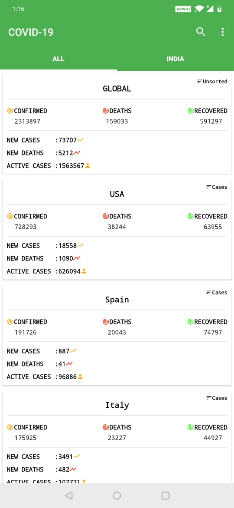
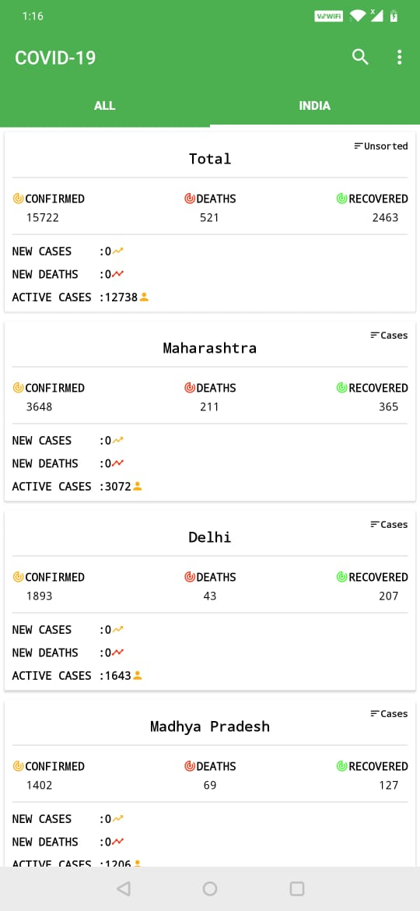
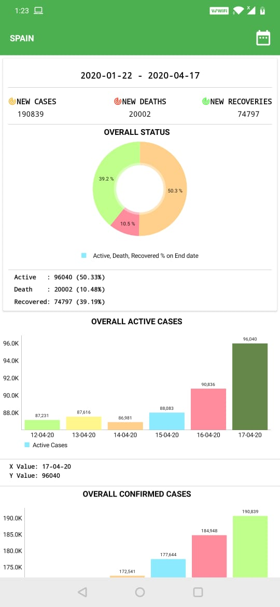
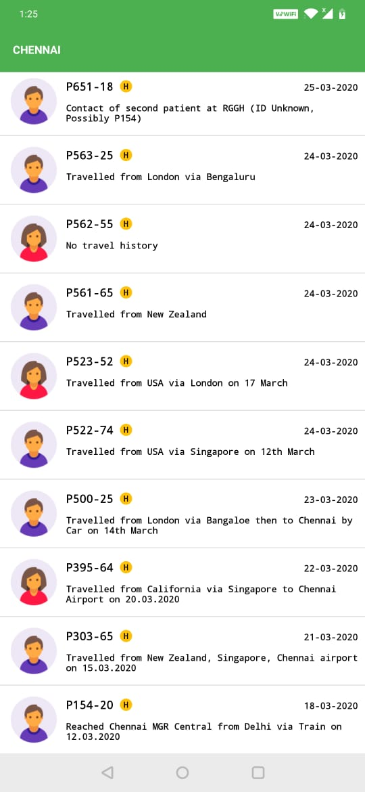

# Covid-19
An android application to monitor Covid-19 status globally.
 

    
     
     
     
  
   
  

<b>API Endpoints</b> 
Global  
https://api.coronastatistics.live/countries 
https://api.coronastatistics.live/all 
https://api.coronastatistics.live/timeline/global 
India 
https://api.rootnet.in/covid19-in/unofficial/covid19india.org/statewise/history 
https://api.rootnet.in/covid19-in/unofficial/covid19india.org/statewise 

